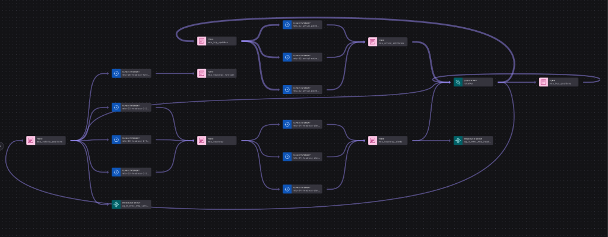
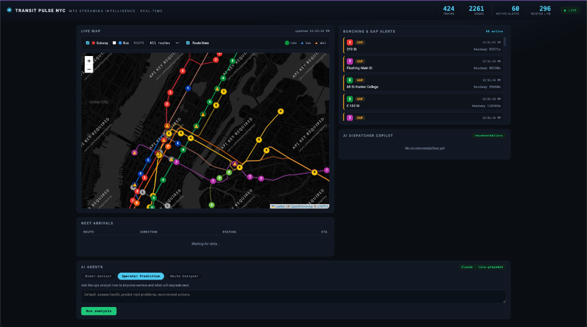

# 🏆 #1 Prize Winner: Confluent AI Day NYC 2026

> **Winner of the #1 Overall Prize for Best Use of the Confluent Platform** at the [Confluent AI Day NYC Hackathon](https://events.confluent.io/confluentaiday2026nyc) (February 2026).
>
> Built with **Confluent Cloud**, **Apache Flink SQL**, **Confluent Schema Registry**, **Managed HTTP Source Connectors**, **Real-Time Context Engine (RTCE)**, and **In-Stream & Interactive AI (Google Gemini Pro & Bedrock)**.

---

# Transit Pulse NYC

*MTA Streaming Intelligence — Real-Time NYC Transit Intelligence Powered by Confluent & AI*

Real-time NYC subway and bus streaming intelligence built on the **Confluent Data Streaming Platform**.

Live MTA GTFS-Realtime feeds flow into Kafka; **Apache Flink SQL** computes live arrival estimates and detects train **bunching** and **service gaps**; and a **Flink Streaming Agent** (LLM running directly *inside* Flink via `AI_RUN_AGENT`) turns each alert into a plain-English **dispatcher action** and a **rider-facing message**.

The dashboard is a high-performance live map: real subway route lines (from static GTFS geometry) with live subway trains and **~3,500+ city buses** — buses carry real GPS lat/lon + heading — moving on top, plus mode/route filters and on-map alert markers. Alongside the map, three **interactive Gemini Pro agents** (Rider Advisor, Fleet Risk Predictor, and Bus Route Designer) answer questions grounded in the live system state.

---

## Screenshots & Live Views

### Confluent Cloud Stream Lineage

*Real-time Stream Lineage in Confluent Cloud: Managed HTTP Source Connector (`mta-service-alerts-http-source`) & live GTFS-RT Kafka topics flowing through Apache Flink continuous queries into `mta_dispatcher_decisions`.*

### Transit Pulse NYC App Dashboard

*Transit Pulse NYC Live Operations Dashboard: Real-time subway trains, ~3,500+ active buses, headway bunching/gap pulse alerts, live arrival countdowns, and interactive Google Gemini Pro operational copilots.*

---

## Core Components & Architecture

| Component | Technology | Description |
|---|---|---|
| **Live GTFS-RT Producer** | Python, Protocol Buffers, Avro | High-throughput streaming ingest of all NYC subway lines and ~3,500+ MTA buses into Kafka topics with Schema Registry Avro serialization. |
| **Managed Connector Ingest** | Confluent HTTP Source Connector | Managed cloud source connector polling real-time MTA service alerts directly from NY Open Data (Socrata) into `mta_service_alerts` with Schema Registry JSON Schema governance. |
| **Stream Processing Engine** | Confluent Cloud Flink SQL | Continuous stream deduplication, ETA computation, Complex Event Processing (CEP `MATCH_RECOGNIZE`) for headway tracking, and predictive bunching/gap forecasting. |
| **In-Stream AI Agent** | Confluent Flink `AI_RUN_AGENT` | Model inference running directly inside Flink continuous queries: evaluates headway alerts and produces concrete dispatcher interventions and rider announcements into `mta_dispatcher_decisions`. |
| **Interactive AI Copilots** | Google Gemini Pro (`google-genai`) | Three on-demand reasoning agents (Rider Advisor, Fleet Risk Predictor, Route Designer) grounded in live fleet snapshots. |
| **Real-Time Context Engine** | Confluent RTCE / MCP | Exposes live transit streams via Model Context Protocol (MCP) to AI coding tools (Claude Code, Cursor, Windsurf, Codex). |
| **Operations Dashboard** | FastAPI, WebSockets, Leaflet.js | Sub-second full-fleet visualization of subway trains, buses, stations, pulse alerts, and interactive AI panels. |

---

## Architecture Flow

```
MTA GTFS-RT ──producers/mta_producer.py──► Kafka (Avro + Schema Registry)
  subway + bus                              mta_vehicle_positions   (train pings)
                                            mta_trip_updates        (arrival predictions)
                                            mta_bus_positions       (live bus GPS + heading)
JSON alerts ──HTTP Source Connector───────► mta_service_alerts      (managed connector, JSON+SR)
        │
        ▼  Confluent Cloud Flink SQL (flink/*.sql, run in order)
   01  CREATE TABLE (register schemas / back topics)
   02  mta_arrival_estimates   live ETA per stop/route/direction        ──► rider board
   03  mta_headway             MATCH_RECOGNIZE consecutive arrivals → headway_seconds
   04  mta_headway_alerts      BUNCHING / GAP  (threshold + optional ML_DETECT_ANOMALIES)
   05  CREATE MODEL            Google AI / Gemini Pro or AWS Bedrock connection
   06  dispatcher_agent        CREATE AGENT + AI_RUN_AGENT  ← the LLM runs IN Flink!
   07  mta_bus_positions       live bus GPS source table
   08  mta_headway_forecast    CEP MATCH_RECOGNIZE → PREDICTED_BUNCHING / GAP
        │
        ▼  dashboard/ (FastAPI + websocket + Leaflet)
   live map (route lines + train/bus icons + alert markers, mode/route filters),
   next-arrivals board, bunching/gap alert feed, AI dispatcher panel,
   + three interactive Gemini Pro agents (advisor / operator / route designer)
```

## Topics

| Topic | Produced by | Description |
|-------|-------------|-------------|
| `mta_vehicle_positions` | Python Producer | Current train position + status (high-volume stream) |
| `mta_trip_updates` | Python Producer | Predicted arrival per stop (GTFS-RT updates) |
| `mta_bus_positions` | Python Producer | Live bus GPS (real lat/lon + heading), ~3,500 buses |
| `mta_arrival_estimates` | Flink SQL | ETA seconds per stop/route/direction |
| `mta_headway` | Flink SQL | Headway between consecutive trains at a stop |
| `mta_headway_alerts` | Flink SQL | Real-time BUNCHING / GAP alerts |
| `mta_headway_forecast` | Flink SQL | Predictive headway trends (CEP `MATCH_RECOGNIZE`) |
| `mta_dispatcher_decisions` | Flink Streaming Agent | In-stream LLM dispatcher action + rider message |
| `mta_service_alerts` | HTTP Source Connector | Real JSON service-alerts feed (managed connector, JSON Schema in SR) |

## Prerequisites

- Python 3.10+ and, for one-command provisioning, the `confluent` CLI (v4+) + `jq`
  (`brew install confluentinc/tap/cli jq`).
- Confluent Cloud auth: just `confluent login` (browser/SSO) — the provisioner
  reuses your session and sets up the cluster, Schema Registry, Flink pool, and
  connections for you.
- An LLM API key:
  - **Google AI / Gemini Pro** (recommended): an [AI Studio](https://aistudio.google.com/apikey) API key (`GEMINI_API_KEY` / `GOOGLEAI_API_KEY`).
  - **AWS Bedrock** (optional): IAM credentials for Claude in `us-east-1`.

## Provision (one command)

`deploy/provision.sh` stands up the entire Confluent side with the `confluent` CLI
(environment, cluster, API keys, Schema Registry, Flink pool, Bedrock connection,
and every Flink statement in order), then writes `.env`.

```bash
pip install -r requirements.txt
python scripts/smoke_test.py                     # (no Confluent needed) proves the live feed decodes

cp deploy/deploy.env.example deploy/deploy.env   # fill in keys + region
./deploy/provision.sh                            # builds everything, writes .env

python scripts/fetch_static_gtfs.py   # stop names + lat/lon for subway trains
python scripts/build_shapes.py        # subway route-line geometry for the map
python producers/mta_producer.py      # stream real MTA feed -> Kafka (subway + buses)
uvicorn dashboard.app:app --port 8000 # dashboard on http://localhost:8000
```

### Verify it's working

```bash
python scripts/smoke_test.py          # prints live vehicle/trip counts per feed (no Kafka)
curl localhost:8000/healthz           # {"status":"ok","live":true,"counts":{...}}
```

Then open http://localhost:8000 — trains and buses should be moving on the map,
the arrivals board fills, and bunching/gap alerts appear as pulsing markers.

Teardown: `./deploy/teardown.sh`. Full details and the manual (click-through
Flink workspace) alternative are in [`deploy/README.md`](deploy/README.md).

Then open **Confluent Cloud → your environment → Stream Lineage** and screenshot it
for the submission form (that screenshot is required and must be real).

## Layout

```
mta-streaming-intelligence/
├── README.md
├── requirements.txt
├── .env.example
├── deploy/                    # one-command Confluent provisioning (CLI-driven)
│   ├── provision.sh           # build env/cluster/pool/connection + submit Flink + connector
│   ├── teardown.sh            # delete the environment and everything under it
│   ├── deploy.env.example     # keys + region (copy to deploy.env)
│   ├── connectors/            # managed connector config templates
│   │   └── http_source_service_alerts.json
│   └── README.md
├── flink/                     # Flink SQL, run in numeric order
│   ├── 01_create_tables.sql
│   ├── 02_arrival_estimates.sql
│   ├── 03_headway.sql
│   ├── 04_headway_alerts.sql
│   ├── 05_create_model.sql
│   ├── 06_dispatcher_agent.sql
│   ├── 07_bus_positions.sql   # live bus GPS source table
│   ├── 08_headway_forecast.sql # predictive bunching/gap (operator prediction)
│   └── 09_service_alerts.sql  # source table over the HTTP Source Connector topic
├── producers/
│   ├── config.py              # env-driven settings (mirrors datagen/config.py)
│   ├── feeds.py               # MTA subway GTFS-RT feed URLs
│   ├── bus_feeds.py           # MTA Bus Time GTFS-RT feed + agency helpers
│   ├── stops.py               # stop_id -> name/lat/lon lookup (static GTFS)
│   └── mta_producer.py        # GTFS-RT (subway + bus) -> Avro -> Kafka
├── dashboard/
│   ├── app.py                 # entrypoint (uvicorn dashboard.app:app)
│   ├── server.py              # FastAPI + websocket + /api/shapes
│   ├── consumer.py            # Kafka -> DashboardState
│   ├── state.py               # thread-safe snapshot
│   ├── agents.py              # interactive Claude agents (advisor/operator/route)
│   └── static/                # index.html, app.js, styles.css (Leaflet)
├── scripts/
│   ├── smoke_test.py          # decode the live feed, print stats
│   ├── fetch_static_gtfs.py   # download stops.txt for map coordinates
│   └── build_shapes.py        # build subway route-line geometry (GeoJSON)
└── docs/
    └── SUBMISSION.md          # answers for the AI Day submission form
```

## Real-Time Fleet Map & Geometry

Static GTFS `shapes.txt` supplies real NYC transit route geometry (drawn as colored polylines, served dynamically from `/api/shapes`). Live vehicles render dynamically on top:
- **Subway Trains**: render as official MTA route bullets snapped to station coordinates with active trip IDs.
- **City Buses**: ~3,500+ buses render as heading-oriented vehicle markers using real-time GPS coordinates.
- **Interactive Controls**: Toggle between **Subway** and **Bus** modes, filter to individual lines/routes, and view pulsing markers for active bunching and gap alerts.

## Dual-Tier AI Architecture

The system splits AI responsibilities between continuous in-stream evaluation and interactive fleet copilots:

1. **In-Flink Streaming AI Agent (`05_create_model.sql` / `06_dispatcher_agent.sql`)**:
   - The dispatcher agent runs *inside* Apache Flink via `AI_RUN_AGENT`.
   - As headway alerts are detected, the model evaluates train spacing and outputs structured operational decisions (`HOLD TRAIN`, `GAP FILL`, `MONITOR`) and passenger announcements into `mta_dispatcher_decisions`.
   - Continuous CEP pattern matching (`08_headway_forecast.sql`) extrapolates arrival intervals to forecast bunching/gaps *before* they occur.

2. **Interactive Fleet Copilots (`dashboard/agents.py`)**:
   - Three on-demand agents powered by **Google Gemini Pro** (`gemini-pro-latest` / `gemini-3.1-pro-preview` via `google-genai`), grounded in the real-time fleet snapshot:
     - **Rider Trip Advisor** (`POST /api/advisor`): Real-time corridor advice and crowd avoidance.
     - **Fleet Risk Predictor** (`POST /api/operator`): Fleet-wide operational risk diagnosis and bottleneck identification.
     - **Bus Route Designer** (`POST /api/route-designer`): Generates new or optimized bus routes with waypoints, stops, rationale, and GeoJSON lines to render directly on the live map.

## Data sources

- **Subway** GTFS-Realtime (no key): feed URLs in [`producers/feeds.py`](producers/feeds.py).
- **Bus** GTFS-Realtime — MTA Bus Time / OneBusAway NYC
  (`https://gtfsrt.prod.obanyc.com/vehiclePositions`), ~2,700 live buses with real
  lat/lon + heading; public feed currently needs no key (an optional free key is
  supported). See [`producers/bus_feeds.py`](producers/bus_feeds.py).
- **Static GTFS** (stop coordinates + route geometry) from
  `http://web.mta.info/developers/data/nyct/subway/google_transit.zip`.
